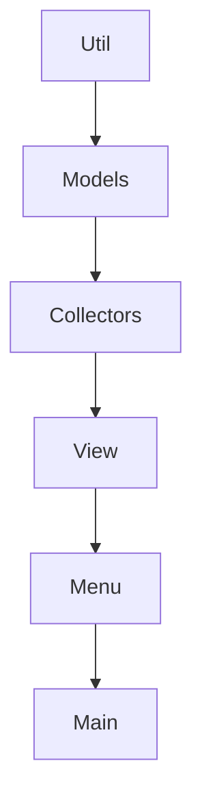

# Monitor de Especificacoes da Maquina

Projeto desenvolvido para monitoramento e diagnóstico de equipamentos, com coleta e análise de informações de hardware e sistema. A solução permite identificar falhas, anomalias e possíveis gargalos de desempenho, além de gerar relatórios técnicos para auxiliar na análise e manutenção das máquinas.

## Opcoes do menu

1. Exibir informacoes do hardware, como sistema, processador e RAM.
2. Exibir espaco em disco.
3. Gerar relatorio
4. Sair.

## Como executar

```bash
python main.py
```

## Estrutura

- `main.py`: ponto de entrada da aplicacao.
- `machine_monitor/menu.py`: menu interativo do terminal.
- `machine_monitor/collectors.py`: classes responsaveis por coletar dados da maquina.
- `machine_monitor/models.py`: modelos de dados usados para organizar as informacoes.
- `machine_monitor/utils.py`: funcoes auxiliares.

Essa separacao facilita adaptar o projeto futuramente para outras interfaces, como uma API, interface grafica ou coleta remota.



## BIBLIOTECAS
- py-cpuinfo
- psutil
- wmi
- winreg
- playwright ( HTML - Relatorio )
- Jinja2 ( HTML - Relatorio )
