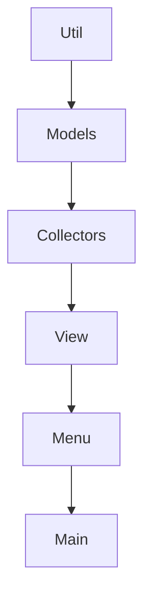

# Monitor de Especificacoes da Maquina

Projeto inicial em Python orientado a objetos para exibir informacoes basicas da maquina pelo terminal.

## Opcoes do menu

1. Exibir informacoes do hardware, como sistema, processador e RAM.
2. Exibir espaco em disco.
3. Sair.

## Como executar

```bash
python main.py
```

## Estrutura

- `main.py`: ponto de entrada da aplicacao.
- `machine_monitor/menu.py`: menu interativo do terminal.
- `machine_monitor/collectors.py`: classes responsaveis por coletar dados da maquina.
- `machine_monitor/models.py`: modelos de dados usados para organizar as informacoes.
- `machine_monitor/utils.py`: funcoes auxiliares.

Essa separacao facilita adaptar o projeto futuramente para outras interfaces, como uma API, interface grafica ou coleta remota.



## BIBLIOTECAS
- py-cpuinfo
- psutil
- wmi