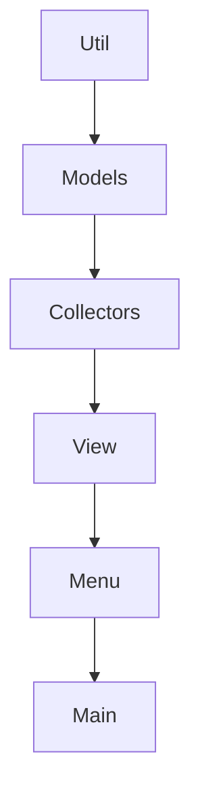

# Especificação de Requisitos de Software (ERS)
**Projeto:** Sistema de para gerar Relatório Técnico de Hardware e SO
**Data documentação:** 22/07/2026
**Versão:** 1.0.0

---

## 1. Introdução

### 1.1. Propósito
Este documento define as especificações e requisitos para o desenvolvimento do aplicativo OverDrive um aplicativo desktop focado em varredura e coleta de dados de hardware, rede e software da máquina hospedeira, culminando na emissão de relatórios técnicos customizados e automáticos.

### 1.2. Perfil dos Usuários (Atores)
* **Analista de Suporte/Infraestrutura:** Usuário principal. 

---

## 2. Requisitos Funcionais (RF)
*Abaixo estão listadas as funcionalidades que o sistema deve prover diretamente aos usuários.*

| Módulo | Descrição do Requisito | Prioridade |
|:---|:---|:---:|
|**Coleta Hadware** | O sistema deve ler e exibir na tela as especificações de Hardware (CPU, GPU, Memoria RAM, SSD/HD). | Alta |
| **Coleta Sistema** | O sistema deve extrair e exibir informações lógicas do Sistema Operacional (Versão e sofware). | Alta |
| **Interface** | O sistema deve carregar uma Interface Gráfica de Usuário (GUI) interativa imediatamente após sua execução, apresentando um painel de controle e opções. | Alta |
| **Exportação** | O sistema deve compilar os dados lidos (RF-01, RF-02) com os dados preenchidos (RF-04) e permitir a exportação do relatório selecionando o formato de saída (HTML ou CSS). | Média |

> **Nota:** Todas as tecnológias necessárias para implementação dos seguintes requisitos, estão listadas abaixo.

---

## 3. Requisitos Não-Funcionais (RNF)
*Restrições técnicas, padrões de arquitetura e atributos de qualidade exigidos pelo sistema.*

### Linguagens e Bibliotecas:

| Tecnologia | Descrição da tecnologia |
|:---|:---|
| **Python 3.14.5** | O sistema será desenvolvido com a linguagem Python (versão 3.14.5) devido à sua simplicidade, produtividade e ampla disponibilidade de bibliotecas para coleta de informações do sistema e geração de relatórios. |
| **HTML/CSS** | Utilizados para a construção do layout do relatório, permitindo a criação de documentos organizados, responsivos e visualmente agradáveis. |
| **Jinja2** | Biblioteca utilizada para gerar o relatório de forma dinâmica, preenchendo templates HTML com as informações coletadas do sistema. |
| **Playwright** | Responsável por renderizar o HTML gerado e convertê-lo em um arquivo PDF para distribuição e documentação. |
| **CustomTkinter** | Biblioteca utilizada para o desenvolvimento da interface gráfica da aplicação, oferecendo uma aparência moderna e intuitiva para o usuário da plicação. |
| **Py-CPUInfo** | Utilizada para obter informações detalhadas sobre o processador da máquina, como fabricante, modelo e frequência. |
| **Psutil** | Responsável pela coleta de informações relacionadas ao uso de recursos do sistema, como memória, discos e processador. |
| **WMI** | Biblioteca utilizada para acessar informações avançadas do Windows através do Windows Management Instrumentation, permitindo obter detalhes de hardware e software do equipamento. |
| **Winreg** | Biblioteca nativa do Python utilizada para acessar o Registro do Windows e coletar informações de softwares instalados no sistema. |

### Estrutura do sistema


## 4. Estrutura do Sistema
A estrutura principal do repositório está organizada da seguinte maneira:

```text
ANALISE DO COMPUTADOR/        # Pacote principal da aplicação
├── machine_monitor/  
│   ├── collectors/           # Scripts de coleta de dados (Hardware/SO)
│   ├── gui/                  # Componentes da Interface Gráfica
│   │   ├── components/       
│   │   └── MainWindow.py     
│   ├── menu/                 # Lógica e estrutura de menus da aplicação
│   ├── models/               # Modelos de dados e regras de negócio
│   ├── relatorios/           
│   ├── reports/              # Módulo de Geração de Relatórios Técnicos
│   │   ├── styles/           
│   │   ├── template/         
│   │   └── ReportGenerator.py
│   ├── utils/                # Funções utilitárias e helpers
│   ├── view/                 # Lógica de visualização (Padrão MVC)
│   └── __init__.py           
├── relatorios/               # Diretório raiz para output dos relatórios gerados
├── .gitignore                
├── main.py                   
├── README.md                 
└── requisitos.
```
### Fluxo de trabalho
